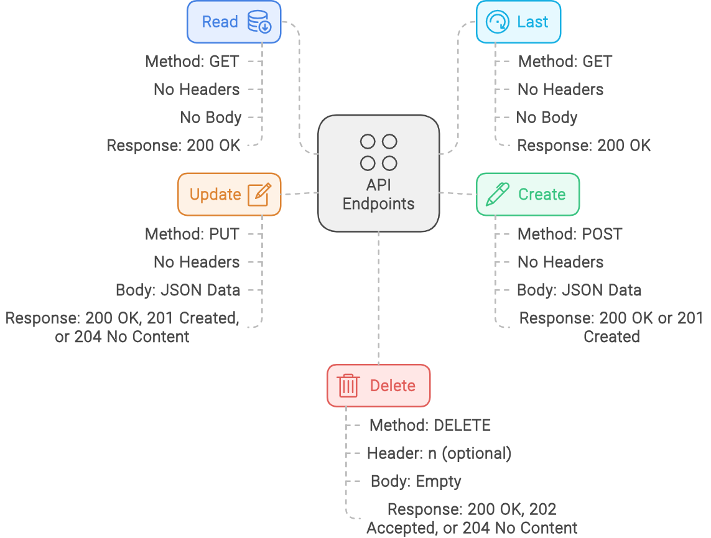

# Information

- [Information](#information)
  * [Name:](#name-)
  * [Description:](#description-)
  * [Variables](#variables)
    + [base_pi_url:](#base_pi_url-)
  * [Endpoints](#endpoints)
    + [Read](#read--get--http---17220181253-5001-read--)
    + [Last](#last--get--http---17220181253-5001-last--)
    + [Create](#create--post--http---17220181253-5001-create--)
    + [Update](#update--put--http---17220181253-5001-update--)
    + [Delete](#delete--delete--http---17220181253-5001-delete--)

## Description: 

REST API & Webserver

This API allows interaction with a webserver running on a Raspberry Pi.

## Variables

### base_pi_url:

This variable stores the base URL of the webserver for reference. It is currently set to "http://172.20.181.253:5001/"

Note: You might need to adjust the base_url variable depending on your network configuration and how you access the Raspberry Pi.

## Endpoints

The API offers five main functionalities: Read, Last, Create, Update, and Delete.

### Read (GET /http://172.20.181.253:5001/read):

Retrieves data from the webserver.

Request:
- Method:
    * GET
    * No headers required
    * No request body

Response:
- Description:
    * Contains the retrieved data. The format of the data depends on the webserver implementation.
    * Successful response code: 200 OK

### Last (GET /http://172.20.181.253:5001/last):

Retrieves last entry from the webserver.

Request:
- Method:
    * GET
    * No headers required
    * No request body

Response:
- Description:
    * Contains the retrieved data. The format of the data depends on the webserver implementation.
    * Successful response code: 200 OK

### Create (POST /http://172.20.181.253:5001/create):

Sends data to the webserver to create a new entry.

Request:
- Method:
    * POST
    * No headers required

- Body:
    * JSON data representing the information to be created. The specific format of the data depends on the webserver implementation. (Example provided in the documentation shows sending a value of 32.8)

Response:
- Description:
    * May contain information about the created entry. The format of the data depends on the webserver implementation.
    * Successful response code: 200 OK or 201 Created

## Update (PUT /http://172.20.181.253:5001/update):

Modifies existing data on the webserver.

Request:
- Method: 
    * PUT
    * No headers required

- Body:
    * JSON data representing the updated information. The specific format of the data depends on the webserver implementation. (Example provided in the documentation shows sending a value of 0)

Response:
- Description:
    * May contain information about the updated entry. The format of the data depends on the webserver implementation.
    * Successful response code: 200 OK, 201 Created, or 204 No Content

### Delete (DELETE /http://172.20.181.253:5001/delete):

Deletes existing data from the webserver.

Request:
- Method: 
    * DELETE
    * **n** can be added to the header, if you want to remove only a specific amount of date
    * This works after FIFO

- Body:
    * Empty

Response:
- Description: 
    * May be empty.
    * Successful response code: 200 OK, 202 Accepted, or 204 No Content
